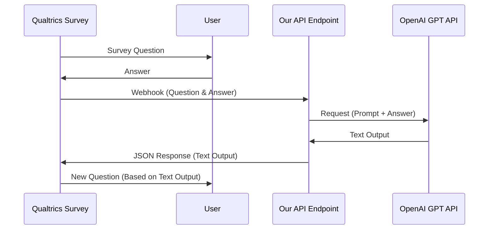

# App Structure

## Overview Diagram


## API Endpoints
- One or two endpoints are needed.
- An actuator for health checks may be required i.e. `/hello-world`.

## Database
- No database is required for this process.

## Authentication
- An API key will be used for authentication to the ChatGPT endpoint.

## POST Endpoint
A POST endpoint `/v1/survey` will be set up with the following request body structure:

```json
{
	"survey": [
		{ "question 1: topic": "What x", "answer topic": "climate change" },
		{ "question 2: political leaning": "What ab", "answer poltical leaning": "89" }
	]
}
```

## Pseudocode
The following pseudocode describes the process of selecting a party from a JSON array and generating a prompt:

```python
randomly select party from JSON/array
var prompt = ""
for each topic in policies { 
	if (answer == topic) {
		if (topic) {
			prompt = topic.get text
			return;
		} else {
			randomly select another party JSON/array
		}
	}
}
```

```python

# Import the random module
import random

# Define a function to get the prompt
def get_prompt(policies, topic):

    # Step 1: Get a list of all parties from the policies
    parties = list(policies.keys())

    # Step 2: Shuffle the list of parties to ensure randomness
    random.shuffle(parties)

    # Step 3: Iterate over each party in the shuffled list
    for party in parties:

        # Step 4: Check if the party has text on the specified topic
        if topic in policies[party] and policies[party][topic]:

            # Step 5: If text exists, return that text as the prompt
            return policies[party][topic]

    # Step 6: If no party has text on this topic, return a default message
    return "No party has text on this topic."


```


## Request to ChatGPT
The request to ChatGPT will take some hardcoded prompt from a JSON document with answers from the request. 

Example of a ChatGPT prompt: 

```
Context: Party Manifesto of Republican & Democratic party
Prompt: There is a Responder that passionate about $User-Input-Topic (i.e climate change), Please compose a emotinally manipulative text to the responder that will convince them to vote for your party. 
```

## Response from ChatGPT 
The response from ChatGPT will be processed and returned by the API.

## API Response
The API response will be a string containing the response from ChatGPT.

## JSON for Party Manifestos
The party manifestos will be stored in a JSON object with the following structure:

```json
{
	"svp": {
		"immigration": "",
		"finance": "",
		"foreign policy": ""
        ...
	},
	"fdp": {
		"immigration": "",
		"finance": "",
		"foreign policy": ""
        ...
	},
    "sp": {
        "immigration": "",
		"finance": "",
		"foreign policy": ""
        ...
    }
```

## Testing

### Webhooks
https://webhook-test.com/
Example Payload:
```json
{
    "key1": "value1",
    "key2": "value2",
"GPT Output" : "Manipulative Text Output from API Endpoint......"
}

```


## Q&A

Action Points:

Whats the logic behind the different answers and questions? 

What is the Logic behind showing which party manifesto/manipulative text?

Are conversations persisted in API call to Chatgpt?  

Can webhooks take answers from later taken survey input?